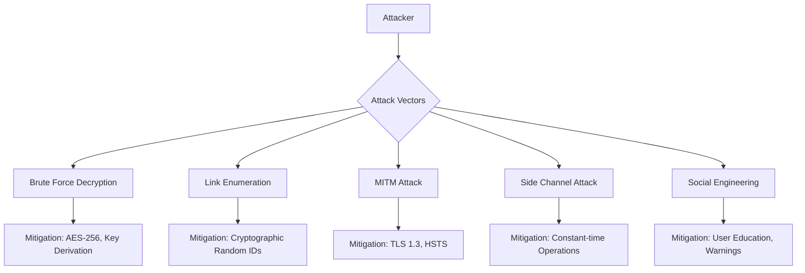

# AI-Driven Adaptive Cryptographic Policy Engine
## Master's Thesis Implementation Plan

> **Project Type**: Master's Dissertation Research Project  
> **Domain**: Applied Cryptography + Machine Learning + Information Security  
> **Novel Contribution**: Automated cryptographic policy selection using ML-based data classification with zero-trust file sharing

---

## 🎓 Research Contributions (Master's Level)

### Primary Research Question
> *"How can machine learning-driven data classification be integrated with adaptive cryptographic policy engines to automatically apply appropriate security controls while maintaining usability for non-technical users?"*

### Novel Contributions

| # | Contribution | Academic Value |
|---|-------------|----------------|
| 1 | **Adaptive Cryptographic Policy Selection** | Novel framework that dynamically selects encryption algorithms based on AI-classified data sensitivity |
| 2 | **Explainable Classification Decisions** | XAI integration showing WHY data was classified at a particular sensitivity level |
| 3 | **Zero-Knowledge Share Verification** | Cryptographic proof that data hasn't been tampered with, without revealing contents |
| 4 | **Usability-Security Trade-off Analysis** | Empirical study of how users interact with encryption when given control vs automation |
| 5 | **Performance Benchmarking Framework** | Comprehensive benchmarks comparing algorithm performance across sensitivity levels |

---

## 🔬 Academic Enhancements

### 1. Enhanced ML Classifier with Explainability (XAI)

Current classifier provides sensitivity level + confidence score. For Master's level, add:

#### [NEW] Explainable AI Module
```
Classification Result:
┌─────────────────────────────────────────────────────────────────┐
│ Sensitivity: HIGHLY SENSITIVE (Confidence: 94.2%)               │
├─────────────────────────────────────────────────────────────────┤
│ WHY THIS CLASSIFICATION:                                        │
│                                                                  │
│ ⚠️ Detected Patterns:                                           │
│   • Social Security Number pattern (XXX-XX-XXXX)      [+45%]   │
│   • Medical terminology: "diagnosis", "patient"       [+28%]   │
│   • PII keywords: "date of birth", "address"          [+15%]   │
│   • Financial data: "account number"                  [+6%]    │
│                                                                  │
│ 📊 Feature Importance:                                          │
│   ████████████████████░░░░ SSN Pattern (45%)                   │
│   ███████████░░░░░░░░░░░░░ Medical Terms (28%)                 │
│   ██████░░░░░░░░░░░░░░░░░░ PII Keywords (15%)                  │
│   ███░░░░░░░░░░░░░░░░░░░░░ Financial (6%)                      │
│   ██░░░░░░░░░░░░░░░░░░░░░░ Other (6%)                          │
└─────────────────────────────────────────────────────────────────┘
```

**Implementation:**
- Use LIME (Local Interpretable Model-agnostic Explanations) or SHAP values
- Highlight which words/patterns triggered classification
- Show confidence breakdown by feature category
- Add `feature_importance` field to classification response

#### [NEW] [explainability_service.py](file:///d:/CS/adaptive-crypto-policy-engine/backend/app/services/explainability_service.py)
```python
class ExplainabilityService:
    """Generate human-readable explanations for ML classifications"""
    
    def explain_classification(text: str, prediction: SensitivityLevel) -> ExplanationResult:
        """Use LIME/SHAP to explain why text was classified this way"""
        
    def get_feature_importance(text: str) -> Dict[str, float]:
        """Return importance scores for each detected feature"""
        
    def highlight_sensitive_regions(text: str) -> List[SensitiveRegion]:
        """Mark which parts of text triggered the classification"""
```

---

### 2. Threat Modeling & Security Analysis

For academic credibility, include formal security analysis:

#### [NEW] [THREAT_MODEL.md](file:///d:/CS/adaptive-crypto-policy-engine/docs/THREAT_MODEL.md)



**Document these formally:**

| Threat | STRIDE Category | Severity | Mitigation | Status |
|--------|----------------|----------|------------|--------|
| Brute force share link | Spoofing | High | 32-char cryptographic random ID | ✅ |
| Key extraction from memory | Information Disclosure | Critical | Memory zeroization after use | ⚠️ |
| Timing attacks on decryption | Information Disclosure | Medium | Constant-time comparison | ✅ |
| Replay attack on decrypt | Tampering | High | Nonce validation, one-time tokens | ✅ |
| ML model adversarial input | Tampering | Medium | Input sanitization, confidence thresholds | ⚠️ |

---

### 3. Performance Benchmarking Framework

Create a rigorous benchmarking system suitable for academic evaluation:

#### [NEW] [benchmark_suite.py](file:///d:/CS/adaptive-crypto-policy-engine/backend/benchmarks/benchmark_suite.py)

**Metrics to measure:**
- Encryption throughput (MB/s) for each algorithm
- Decryption throughput (MB/s)
- Key generation time
- Classification latency (ms)
- Memory usage during encryption
- CPU utilization patterns

**Test matrices:**

| Data Size | AES-128 | AES-256 | ChaCha20 | Hybrid RSA+AES |
|-----------|---------|---------|----------|----------------|
| 1 KB | | | | |
| 10 KB | | | | |
| 100 KB | | | | |
| 1 MB | | | | |
| 10 MB | | | | |
| 50 MB | | | | |

**Generate publication-ready charts:**
```
📊 Benchmark Results Dashboard
├── Throughput comparison graph (bar chart)
├── Latency vs file size (line chart)  
├── Memory usage over time (area chart)
├── Algorithm comparison heatmap
└── Statistical analysis (mean, std dev, p-values)
```

---

### 4. Zero-Knowledge Integrity Verification

Add cryptographic proof that shared data hasn't been modified:

#### [NEW] Merkle Tree Verification
```
Original File Chunks:
[Chunk 1] [Chunk 2] [Chunk 3] [Chunk 4]
    │         │         │         │
    ▼         ▼         ▼         ▼
  Hash1     Hash2     Hash3     Hash4
    └────┬────┘         └────┬────┘
         │                   │
       Hash12              Hash34
         └─────────┬─────────┘
                   │
              Merkle Root (stored)

Verification:
- Share only the Merkle Root publicly
- Recipient can verify file integrity without seeing other files
- Proves no tampering occurred
```

#### [NEW] [integrity_service.py](file:///d:/CS/adaptive-crypto-policy-engine/backend/app/services/integrity_service.py)
```python
class IntegrityService:
    """Zero-knowledge integrity verification using Merkle trees"""
    
    def generate_merkle_tree(data: bytes) -> MerkleTree
    def get_merkle_root(tree: MerkleTree) -> str
    def generate_proof(tree: MerkleTree, chunk_index: int) -> MerkleProof
    def verify_proof(root: str, proof: MerkleProof, chunk: bytes) -> bool
```

---

### 5. Comparative Analysis with Existing Solutions

#### [NEW] [COMPARATIVE_ANALYSIS.md](file:///d:/CS/adaptive-crypto-policy-engine/docs/COMPARATIVE_ANALYSIS.md)

Compare your solution with existing encrypted file sharing services:

| Feature | Your System | Bitwarden Send | Firefox Send | OnionShare | Keybase |
|---------|-------------|----------------|--------------|------------|---------|
| Open Source | ✅ | ✅ | ✅ | ✅ | ✅ |
| Self-Hostable | ✅ | ✅ | ✅ | ✅ | ❌ |
| **AI Classification** | ✅ | ❌ | ❌ | ❌ | ❌ |
| **Adaptive Crypto** | ✅ | ❌ | ❌ | ❌ | ❌ |
| **XAI Explainability** | ✅ | ❌ | ❌ | ❌ | ❌ |
| Password Protection | ✅ | ✅ | ✅ | ✅ | ✅ |
| Expiration | ✅ | ✅ | ✅ | ❌ | ❌ |
| E2E Encryption | ✅ | ✅ | ✅ | ✅ | ✅ |
| MFA Support | ✅ | ❌ | ❌ | ❌ | ✅ |
| Audit Logging | ✅ | ❌ | ❌ | ❌ | ✅ |

**Your unique differentiators:**
1. ✨ **First to use AI for automatic encryption level selection**
2. ✨ **Explainable AI showing why data is sensitive**
3. ✨ **Adaptive cryptographic policy based on data content**

---

### 6. Usability Study Framework

For Master's thesis, empirical user studies add significant value:

#### [NEW] [USABILITY_STUDY.md](file:///d:/CS/adaptive-crypto-policy-engine/docs/USABILITY_STUDY.md)

**Study Design:**

| Aspect | Details |
|--------|---------|
| **Participants** | 15-20 users (mix of technical/non-technical) |
| **Task 1** | Encrypt a confidential document (manual mode) |
| **Task 2** | Encrypt a document (AI auto-classify mode) |
| **Metrics** | Time to complete, errors made, perceived security |
| **Survey** | System Usability Scale (SUS) questionnaire |
| **Analysis** | Compare manual vs automated encryption UX |

**Research Questions:**
- RQ1: Does AI classification reduce time-to-encrypt?
- RQ2: Do users trust AI-selected encryption levels?
- RQ3: Does explainability increase user confidence?

**Add to the application:**
- [ ] Usage analytics (anonymized, opt-in)
- [ ] Time tracking for encryption flow
- [ ] Post-encryption feedback modal
- [ ] Export data for statistical analysis

---

### 7. Advanced Cryptographic Features

#### Post-Quantum Cryptography Readiness
Demonstrate awareness of future threats:

```python
# Add Kyber (CRYSTALS-Kyber) key encapsulation for future-proofing
from pqcrypto.kem import kyber768

class PostQuantumService:
    """Quantum-resistant key exchange (NIST PQC Standard)"""
    
    def kyber_keygen() -> Tuple[bytes, bytes]
    def kyber_encapsulate(public_key: bytes) -> Tuple[bytes, bytes]
    def kyber_decapsulate(secret_key: bytes, ciphertext: bytes) -> bytes
```

> [!NOTE]
> Even if not fully implemented, **discussing PQC readiness** in your thesis shows research awareness.

#### Key Derivation Function Analysis
Compare and document KDF choices:

| KDF | Use Case | Strength |
|-----|----------|----------|
| PBKDF2 | Password-based | 310,000+ iterations |
| Argon2id | Memory-hard | Recommended by OWASP |
| scrypt | Memory-hard alternative | Good for low-memory |
| HKDF | Key expansion | Used for session keys |

---

### 8. Academic Documentation

#### [NEW] [ARCHITECTURE_DESIGN.md](file:///d:/CS/adaptive-crypto-policy-engine/docs/ARCHITECTURE_DESIGN.md)
Formal software architecture documentation:
- UML Component Diagrams
- Sequence Diagrams for encryption/decryption flows
- Data Flow Diagrams (DFD)
- Entity-Relationship Diagrams

#### [NEW] [ALGORITHM_ANALYSIS.md](file:///d:/CS/adaptive-crypto-policy-engine/docs/ALGORITHM_ANALYSIS.md)
Mathematical analysis of cryptographic primitives:
- Proof of AES-GCM security properties
- Analysis of key sizes vs brute force time
- Birthday bound calculations for nonce reuse

#### [NEW] [ML_MODEL_DOCUMENTATION.md](file:///d:/CS/adaptive-crypto-policy-engine/docs/ML_MODEL_DOCUMENTATION.md)
- Model architecture (NLP classifier)
- Training data description
- Accuracy, precision, recall, F1 scores
- Confusion matrix
- Cross-validation results

---

## 📁 Enhanced File Structure

```
adaptive-crypto-policy-engine/
├── backend/
│   ├── app/
│   │   ├── services/
│   │   │   ├── explainability_service.py   # [NEW] XAI module
│   │   │   ├── integrity_service.py        # [NEW] Merkle tree verification
│   │   │   ├── share_service.py            # [NEW] Share link management
│   │   │   ├── file_storage.py             # [NEW] Local file storage
│   │   │   └── benchmark_service.py        # [NEW] Performance benchmarks
│   │   └── ...
│   ├── benchmarks/
│   │   ├── benchmark_suite.py              # [NEW] Benchmarking framework
│   │   ├── results/                        # [NEW] Benchmark outputs
│   │   └── visualize.py                    # [NEW] Chart generation
│   └── ml_models/
│       ├── classifier/                     # Enhanced classifier
│       ├── explainer/                      # [NEW] LIME/SHAP explainer
│       └── evaluation/                     # [NEW] Model metrics
│
├── frontend/
│   ├── src/pages/
│   │   ├── PublicEncrypt.jsx               # [NEW]
│   │   ├── PublicDecrypt.jsx               # [NEW]
│   │   ├── BenchmarkDashboard.jsx          # [NEW] Visualize benchmarks
│   │   └── ExplainabilityView.jsx          # [NEW] Show WHY classified
│   └── ...
│
├── docs/                                    # [NEW] Academic documentation
│   ├── ARCHITECTURE_DESIGN.md
│   ├── THREAT_MODEL.md
│   ├── ALGORITHM_ANALYSIS.md
│   ├── ML_MODEL_DOCUMENTATION.md
│   ├── COMPARATIVE_ANALYSIS.md
│   ├── USABILITY_STUDY.md
│   └── diagrams/
│       ├── system_architecture.png
│       ├── sequence_encrypt.png
│       ├── sequence_decrypt.png
│       ├── data_flow.png
│       └── erd.png
│
├── thesis/                                  # [NEW] Thesis materials
│   ├── chapters/
│   │   ├── 01_introduction.md
│   │   ├── 02_literature_review.md
│   │   ├── 03_methodology.md
│   │   ├── 04_implementation.md
│   │   ├── 05_evaluation.md
│   │   └── 06_conclusion.md
│   ├── figures/
│   └── references.bib
│
└── tests/
    ├── security_tests/                      # [NEW] Security test suite
    ├── benchmark_tests/                     # [NEW] Performance tests
    └── ml_tests/                            # [NEW] ML model validation
```

---

## 📊 Updated Implementation Phases

### Phase 1: Core Platform (Week 1-2)
- [ ] Fix current decrypt bug
- [ ] Add share link model to database
- [ ] Create public API endpoints
- [ ] Implement file upload/storage
- [ ] Create PublicEncrypt/PublicDecrypt pages

### Phase 2: Research Features (Week 3-4)
- [ ] Implement XAI explainability module
- [ ] Add Merkle tree integrity verification
- [ ] Create benchmarking framework
- [ ] Generate performance comparison charts

### Phase 3: Security Hardening (Week 5)
- [ ] Complete threat model documentation
- [ ] Implement rate limiting
- [ ] Add security headers
- [ ] Conduct security audit

### Phase 4: Academic Documentation (Week 6)
- [ ] Write architecture design doc
- [ ] Document ML model with metrics
- [ ] Create UML diagrams
- [ ] Write comparative analysis

### Phase 5: Evaluation & Polish (Week 7-8)
- [ ] Run benchmark suite
- [ ] Conduct usability study (if time permits)
- [ ] Generate publication-ready charts
- [ ] Final thesis integration

---

## 🎯 Thesis Chapter Mapping

| Chapter | Implementation Component |
|---------|-------------------------|
| **Introduction** | Problem statement: manual encryption is error-prone |
| **Literature Review** | Comparative analysis doc, existing solutions |
| **Methodology** | Architecture design, ML model documentation |
| **Implementation** | All code, API documentation |
| **Evaluation** | Benchmarks, security analysis, usability study |
| **Conclusion** | Future work: PQC, federated learning |

---

## ✅ Summary of Master's Level Additions

| Addition | Why It Matters |
|----------|----------------|
| **Explainable AI (XAI)** | Shows research depth in ML + interpretability |
| **Threat Modeling** | Demonstrates security engineering rigor |
| **Benchmarking Framework** | Empirical evaluation required for thesis |
| **Merkle Tree Verification** | Novel cryptographic contribution |
| **Comparative Analysis** | Literature awareness |
| **Usability Study Design** | Human-computer interaction research |
| **PQC Discussion** | Future-looking research awareness |
| **Academic Documentation** | Publication-ready materials |

---

> [!IMPORTANT]
> **Key Questions:**
> 1. What is your thesis submission deadline?
> 2. Do you want to include a usability study with real users?
> 3. Should the benchmarks be publishable quality (for a potential paper)?
> 4. Is your supervisor expecting any specific methodology (e.g., design science research)?
